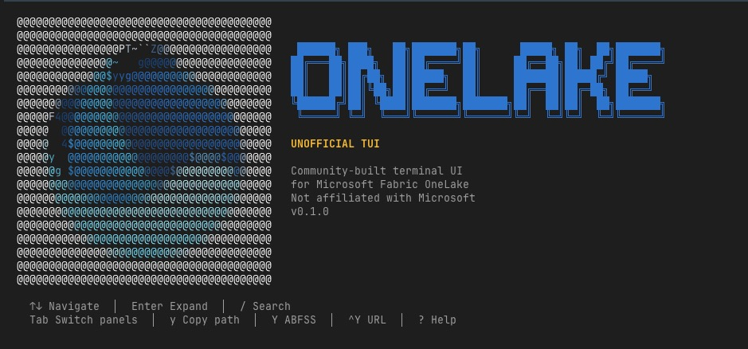

# OneLakeTools

Unofficial developer tools for [Microsoft Fabric](https://learn.microsoft.com/en-us/fabric/) OneLake.



## 🖥️ OneLake TUI

A terminal UI for browsing Fabric workspaces, lakehouses, and Delta tables. No portal, no notebooks — just your terminal.

```bash
pip install onelake-tui
az login
onelake-tui
```

`onelake-tui` is the PyPI distribution for this repo and includes both the TUI and the bundled `onelake_client` library.

**Highlights:**
- Three-panel layout: workspace picker → item list → DFS tree + preview
- Rich file preview: Markdown, JSON, CSV, Parquet, Avro, syntax-highlighted code
- Delta table detail: schema, data preview, transaction history, CDF, parquet analysis
- Live workspace search, breadcrumb path display, and copy menu (`y`) for HTTPS/ABFSS named+GUID formats
- Multi-environment support via `--env` flag (PROD, MSIT, DXT, DAILY)
- Keyboard-driven, zero-config (uses `az login`)

See [`TUI/README.md`](TUI/README.md) for full documentation.

### 📦 Included: OneLake Client Library

The TUI ships with a standalone async Python client that you can also use directly. We may publish the client separately in a future release, but today it is distributed with `onelake-tui`.

```python
from onelake_client import OneLakeClient

async with OneLakeClient() as client:
    workspaces = await client.fabric.list_workspaces()
    paths = await client.dfs.list_paths(ws_id, "MyLakehouse.Lakehouse")
```

| API | Module | Purpose |
|-----|--------|---------|
| Fabric REST | `fabric/` | Workspace/item enumeration (control plane) |
| OneLake DFS | `dfs/` | File/folder operations via ADLS Gen2 (data plane) |
| Table APIs | `tables/` | Delta Lake + Iceberg metadata (metadata plane) |

## Authentication

All tools use [`DefaultAzureCredential`](https://learn.microsoft.com/en-us/python/api/azure-identity/azure.identity.defaultazurecredential), supporting:

| Method | Use case |
|--------|----------|
| `az login` | Local development |
| Service principal env vars | CI/CD pipelines |
| Managed identity | Azure-hosted environments |

## Environment Configuration

Use the `--env` flag to target different Fabric rings:

```bash
uv run onelake-tui              # PROD (default)
uv run onelake-tui --env msit   # Microsoft internal testing
uv run onelake-tui --env dxt    # Developer testing
uv run onelake-tui --env daily  # Daily builds
```

Each environment maps to the correct Fabric REST and OneLake DFS hostnames automatically.

## Development

```bash
cd TUI
uv sync --all-extras    # Install all dependencies
uv run pytest           # Run tests
uv run ruff check src/  # Lint
uv run onelake-tui      # Launch the TUI
```

## Testing

**762 tests** across 33 test files — 612 unit + 150 integration, including 8 snapshot regression tests ([syrupy](https://github.com/syrupy-project/syrupy)).

### Test Layers

1. **Unit tests** (`tests/`) — mock-based, no Fabric access needed
   - Client library: auth, HTTP, DFS, Fabric API, Delta reader (protocol extraction, warnings), Iceberg, models
   - TUI widgets: smoke, navigation flow, file previews (9 formats), table views (schema/data/history/CDF/analysis tabs), tree edge cases
   - Fixtures: Delta tables (10 committed fixtures), Parquet files (3 fixtures)
   - Snapshots: Delta metadata + Parquet schema regression detection

2. **Integration tests** (`tests/integration/`) — live Fabric workspace
   - Config: `fabric-test-env.json` manifest (in-repo, auto-detected)
   - Coverage: DFS browsing, Delta metadata for 15 tables, file operations, schema folders, warehouse + Iceberg, mirrored DBs, protocol features
   - Both GUID and friendly-name addressing modes tested

### Running Tests

```bash
cd TUI
uv sync --extra dev
uv run pytest --ignore=tests/integration  # Unit tests only (fast, ~80s)
uv run pytest tests/integration/ -v       # Integration tests (needs az login, ~5min)
uv run pytest                             # Everything (needs az login)
uv run pytest --snapshot-update           # Update snapshots after fixture changes
```

See [`docs/testing.md`](docs/testing.md) for the full testing guide.

## Project Structure

```
OneLakeTools/
├── TUI/
│   ├── src/
│   │   ├── onelake_client/    # Standalone async Python client library
│   │   │   ├── auth.py        #   Dual-scope token management
│   │   │   ├── _http.py       #   httpx retry + pagination
│   │   │   ├── environment.py #   Environment ring config (PROD/MSIT/DXT/DAILY)
│   │   │   ├── fabric/        #   Fabric REST API (control plane)
│   │   │   ├── dfs/           #   OneLake DFS API (data plane)
│   │   │   ├── tables/        #   Delta + Iceberg readers (metadata plane)
│   │   │   └── models/        #   Pydantic data models
│   │   └── onelake_tui/       # Textual-based terminal UI
│   │       ├── app.py         #   Main app, keybindings, event wiring
│   │       ├── workspace_picker.py  # Flat filterable workspace list
│   │       ├── item_list.py   #   Item list for selected workspace
│   │       ├── tree.py        #   DFS file tree (single item)
│   │       ├── detail.py      #   Detail/preview with rich rendering
│   │       ├── sprite.py      #   OneLake-inspired splash art + animation
│   │       ├── status_bar.py  #   3-line footer
│   │       └── nodes.py       #   Node dataclasses
│   ├── tests/                 # Unit + integration tests
│   ├── pyproject.toml         # uv-managed project config
│   └── README.md              # TUI-specific docs
└── README.md                  # This file
```

## Roadmap

| Tool | Status |
|------|--------|
| OneLake TUI (Unofficial) | ✅ Working (browse, preview, inspect, copy path) |
| File preview (MD/JSON/CSV/Parquet/Avro) | ✅ Done |
| Delta table detail (schema/data/history/CDF/analysis) | ✅ Done |
| Workspace search/filter | ✅ Done |
| [OneLake CLI](https://github.com/lmoloney/OneLakeTools/issues/11) | 🔲 Planned (`onelake ls`, `onelake cat`, `onelake cp`) |
| [Download/upload](https://github.com/lmoloney/OneLakeTools/issues/12) | 🔲 Planned |
| [Shortcuts discoverability/manageability](https://github.com/lmoloney/OneLakeTools/issues/13) | 🔲 Planned |
| [ADLS direct connections](https://github.com/lmoloney/OneLakeTools/issues/14) | 🔲 Planned |
| [OneLake security policy management](https://github.com/lmoloney/OneLakeTools/issues/15) | 🔲 Planned |
| [Bulk operations](https://github.com/lmoloney/OneLakeTools/issues/16) | 🔲 Planned |
| [Copying data + soft-deleted data handling](https://github.com/lmoloney/OneLakeTools/issues/17) | 🔲 Planned |

## License

MIT
