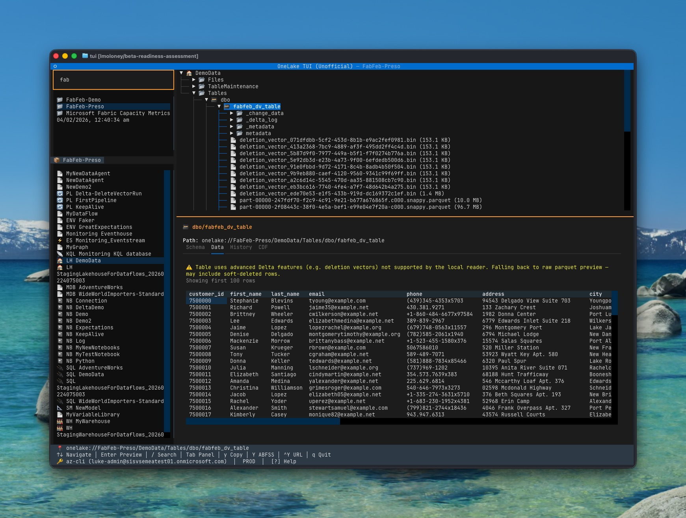

# OneLake TUI (Unofficial)

An unofficial terminal UI for browsing Microsoft Fabric workspaces, lakehouses, and Delta tables — built with [Textual](https://textual.textualize.io/).




## Features

- **Three-panel layout** — workspace picker → item list → DFS file tree + detail/preview
- **OneLake-inspired splash art** — animated startup logo with Fabric-styled shimmer
- **Live search** — press `/` to filter workspaces instantly
- **File preview** — Enter on any file for rich rendering:
  - **Markdown** rendered natively
  - **JSON** pretty-printed (handles NDJSON/Delta log format)
  - **CSV** displayed as a DataTable
  - **Parquet** schema + first 100 rows via pyarrow
  - **Avro** schema + first 100 rows via fastavro
  - **Code** syntax-highlighted (Python, SQL, YAML, etc.)
  - All previews are **selectable/copyable** via TextArea
- **Delta table metadata** — tabbed detail view:
  - **Schema** tab — version, files, size, partitions, column DataTable
  - **Data** tab — lazy-loaded first 100 rows (with deletionVectors fallback)
  - **History** tab — transaction log from `_delta_log/*.json` with timestamps
  - **CDF** tab — conditional, only shown when Change Data Feed is enabled
- **Schema-aware table detection** — supports `Tables/schema/table` (mirrored DBs) and `Tables/table` (lakehouses)
- **Expandable tables** — browse raw `_delta_log/`, parquet files, metadata
- **Human-readable paths** — `onelake://workspace/item/path` everywhere
- **Type-tagged items** with coloured badges (LH, WH, NB, RPT, MDB, etc.)
- **3-line status bar** — path, keyboard shortcuts (always visible), auth/env info
- **Multi-environment support** — PROD, MSIT, DXT, DAILY via `--env` flag
- **Keyboard-driven** — zero-config, uses `az login`

## Installation

**Prerequisites:** Python 3.11+, [uv](https://docs.astral.sh/uv/), Azure CLI (`az login`)

```bash
cd TUI
uv sync
uv run onelake-tui
```

## Quick Start

1. **Authenticate** — run `az login` if you haven't already
2. **Launch** — `uv run onelake-tui` (or `uv run onelake-tui --env msit` for internal environments)
3. **Select workspace** — pick from the left panel, items load below
4. **Select item** — click a lakehouse/warehouse/mirrored DB to load its DFS tree
5. **Browse files** — expand folders in the tree (right panel)
6. **Preview** — press Enter on any file to preview its contents
7. **Explore tables** — expand `Tables/` to see schemas and Delta metadata
8. **Search** — press `/` to filter workspaces, Escape to clear

## Keybindings

| Key | Action |
|-----|--------|
| `↑` / `↓` | Navigate |
| `←` / `→` | Collapse/expand tree nodes |
| `Enter` | Preview file / Expand folder |
| `/` | Search/filter workspaces |
| `Escape` | Close search / go back |
| `Tab` / `Shift+Tab` | Switch panels |
| `y` | Copy `onelake://` path to clipboard |
| `Y` (Shift) | Copy `abfss://` GUID path to clipboard |
| `Ctrl+Y` | Copy `https://` DFS URL to clipboard |
| `r` | Refresh |
| `?` | Show help |
| `q` | Quit |

## Architecture

```
TUI/src/
├── onelake_client/            # Standalone async Python client library
│   ├── auth.py                #   Dual-scope token management
│   ├── environment.py         #   Environment ring config (PROD/MSIT/DXT/DAILY)
│   ├── _http.py               #   httpx retry + pagination
│   ├── fabric/client.py       #   Fabric REST API (control plane)
│   ├── dfs/client.py          #   OneLake DFS API (data plane)
│   ├── tables/delta.py        #   Delta table metadata reader
│   ├── tables/iceberg.py      #   Iceberg table metadata reader
│   └── models/                #   Pydantic data models
└── onelake_tui/               # Textual-based terminal UI
    ├── app.py                 #   Main app, keybindings, event wiring
    ├── app.tcss               #   Layout CSS (3-panel + footer)
    ├── workspace_picker.py    #   Flat filterable workspace list
    ├── item_list.py           #   Item list for selected workspace
    ├── tree.py                #   DFS file tree (single item)
    ├── detail.py              #   Detail/preview panel with rich rendering
    ├── sprite.py              #   OneLake-inspired splash art + shimmer animation
    ├── status_bar.py          #   3-line footer (path, shortcuts, auth)
    ├── nodes.py               #   Node dataclasses
    └── banner.py              #   Welcome screen delegate
```

**Navigation model:** Workspace → Item → DFS files/folders/tables. Each stage is a separate widget:
- `WorkspacePicker` (flat OptionList, filterable)
- `ItemList` (flat OptionList per workspace)
- `OneLakeTree` (lazy-loading tree per item)
- `DetailPanel` (context-aware: metadata on highlight, preview on Enter)

## Auth Configuration

Authentication uses `DefaultAzureCredential`, which supports (in order):

| Method | Use case |
|--------|----------|
| `az login` | Local development |
| Service principal | CI/CD pipelines |
| Managed identity | Azure-hosted environments |

## Environment Configuration

```bash
uv run onelake-tui              # PROD (default)
uv run onelake-tui --env msit   # Microsoft internal testing
uv run onelake-tui --env dxt    # Developer testing
uv run onelake-tui --env daily  # Daily builds
```

Each environment maps to the correct Fabric REST and OneLake DFS hostnames automatically.

## Debugging

```bash
tail -f ~/.onelake-tui/debug.log
```

## Development

```bash
cd TUI
uv sync --all-extras
uv run pytest           # 43 unit + 6 integration tests
uv run ruff check src/  # Lint
uv run ruff format src/ # Format
```

## License

MIT
